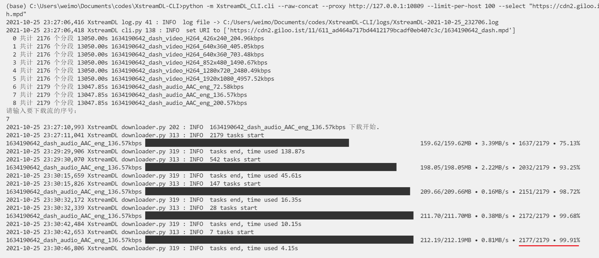

# XstreamDL-CLI

基于`python 3.7.4+`的，命令行版本的，HLS/DASH流下载器，仅支持**HLS标准AES-128-CBC**解密

## 使用

**首先将`ffmpeg`和`mp4decrypt`的可执行文件放置在`binaries`文件夹中**

[可执行文件下载链接点此](https://github.com/xhlove/XstreamDL-CLI/releases/download/1.3.1/binaries.7z)

安装必要的库

```bash
pip install -r requirements.txt
```

使用样式示例

```bash
python -m XstreamDL_CLI.cli [OPTION]... URL/FILE/FOLDER...
```

简单示例

```bash
python -m XstreamDL_CLI.cli --b64key oKi/hwKVuLveo/hISX1PQw== --hexiv b3d5ca56926d49d8e96b70aa5c7b358e --name 第一节总论 https://hls.videocc.net/d06ae002cb/2/d06ae002cb4a0bed78fb912c874fdbb2_2.m3u8
```

## 一些概念

README中存在一些对于新人不友好的术语或者我使用的名词，这里写一点说明，希望有帮助

**元数据**

通常情况下，直接访问m3u8/mpd链接可以看到**含有完整或部分**分段链接的文本内容，这些内容被称为元数据

通过元数据和m3u8/mpd链接，软件可以转换出全部分段链接，最终用于下载

也就是说软件所需要的链接是存放**元数据**的链接

**分段链接**

怎么会有人不知道什么是分段链接？根据我收到的反馈，真的有...

所谓**分段链接就是媒体文件的链接**，如果你下载某个链接，然后使用文本编辑器打开，例如记事本

发现显示在你眼前的是一些看不懂的**乱码**，恭喜你，你下载的是分段链接

**初始分段链接/init分段**

怎么知道一个分段链接是不是初始分段链接？

通常情况下，在加载**元数据**链接之后紧接着加载的分段链接，就是初始分段链接

当然上面的说法不是百分百正确，另一个判断方法是检查链接中`?`之前（如果有?的话）的末尾部分，是不是诸如`map.xxx`以及`init.xxx`的字符

如果是，那么这就是一个初始分段链接

更加准确的判断方法？

当然有，你下载这个分段链接后，使用`mediainfo`这一类工具查看其属性，如果有**时间**、**码率**等信息，并且这个文件**只有几KB**大小

那么这就是一个初始分段链接

## 如何反馈

首先，请在使用软件前仔细阅读此README的**详细说明**，本软件在使用上存在一定门槛

当你确实遭遇到无法下载的链接，请先检查下面的问题

- 输入链接是不是不被软件支持？
    - 案例一，有用户想下载dash流中的字幕，但传入的链接是init分段的链接。软件需要的是mpd链接而不是分段链接
    - 案例二，用户希望下载m3u8直播流，但下载失败。阅读下面的详细说明的**直播录制**后你就会知道目前还没有实现m3u8直播下载
- 是不是和浏览器/抓包结果中链接不一样？
    - 链接一样，请阅读**访问受限**
    - **raw.json**中的链接是正确链接的一部分，请阅读**链接鉴权**
    - **raw.json**中的链接**后半部分**是正确链接的一部分，请阅读**未成功下载任何文件**
    - **raw.json**中的链接**前半部分**是正确链接的一部分，但后半部分和正确链接八竿子打不着，请提issue
- 是不是没有使用代理？
    - 案例一，用户开启了全局代理，但无法下载视频。注意软件目前**仅支持http代理，并且默认不走系统代理**

为了方便理解彼此的意图，反馈时请尽可能提供下面的信息

- 目标链接
- 你所使用的完整命令
- 正确的初始分段链接，除初始分段外的任意一个分段链接
- 是否存在ip访问限制，如果存在这种可能性，请务必说明可以访问该链接的的地区
- 是否存在时效性限制，特别是直播流
- 对于存在鉴权、时效性较短的链接，请提供m3u8/mpd(元数据)文件
    - 你可以通过抓包/浏览器F12查看响应得到内容，然后复制保存到本地
- 目标链接对应的在线网页地址

**如果不想暴露目标链接/网站，请发送信息到我的邮箱**

## 详细说明

### 下载默认/指定流

当前软件提供了`--select`选项用于辅助用户选择需要下载的流

但更多的用户希望可以通过指定分辨率、最佳质量一类选项进行下载

**这会在以后实现**

### 未成功下载任何文件

对于这种情况，请检查浏览器中的分段链接是否与`raw.json`文件中的一致

不一致，请上报详细信息给我

### 下载加速

如果要下载的目标文件所在的服务器与下载器直接的连接性较差，比如在你使用代理的时候，你可以选择

- 增大`--limit-per-host`数值，以提升下载速度
- 开启`--disable-force-close`选项，提升下载速度

如果连接性较好，则保持默认就好，当然`--disable-force-close`也是推荐开启的

Q: 为什么`--disable-force-close`选项不是默认开启

A: 之前在编写软件过程中，出现过bug，某个循环异常，开启该选项后导致在极短时间内网络连接数耗尽，然后网络瘫痪，所以默认强制关闭链接，以确保不会发生这种情况

### 直播录制

目前仅支持dash流的录制，可以通过`--live`选项指明这是直播流

通过`--live-duration`指明要录制的时长，该选项不是特别准确，最终文件时长通常大于期望的时长

如果是回放类型的dash流，可以尝试普通模式下载

**后续会尝试支持m3u8直播流**

### 代理

目前`--proxy`选项支持设定`socks5`和`http`代理，示例

- `socks5://127.0.0.1:10808`
- `http://127.0.0.1:10809`

### m3u8解密

下载器会自动尝试下载key，但目前绝大部分网站是不提供可直接用于解密的key的

所以需要手动指定解密所使用的`key`和`iv`

- `--b64key` base64编码的解密key字符串
- `--hexiv` 16进制形式的解密iv字符串，如果不设置则默认是二进制0

### dash流解密

下载器调用`mp4decrypt`解密，请通过`--key`设置解密key，不设置则会强制二进制合并

### ism解密

**暂不支持**

似乎是可以通过`mp4decrypt`进行解密的，但是我不知道如何构造解密需要的文件头，如果有人可以提供这方面的帮助，请联系我

### 访问受限

某些网站需要携带cookies、referer或者特定的请求头才能访问分段文件，这种情况可以通过设置`--headers`实现正常下载

### 链接鉴权

某些网站会在常规的链接后面增加一系列参数，用于检查用户是否有权限访问，通常情况下和流本身无关，往往是相同的内容，常见于dash类型流

遇到这种情况，可以使用`--url-patch`设置这部分内容，例如mpd域名是`nammaflix-streams.streamready.in`

### 仅解析

`--parse-only`表明仅仅解析流，而不会进行任何下载，使用该选项，只会产生`raw.json`文件

### 重复流

如果经常使用本下载器下载dash流，可能会发现有的网站两条流名字完全一样，实际上查看mpd内容，确实如此

`--index-to-name`正是为了处理这一问题而设置的

此外可以与`--show-init`搭配使用，将会显示对应的初始分段链接，辅助选择需要下载的流

### 日志

目前下载器添加了详细的日志记录，用于辅助程序异常定位，输出日志在`logs`文件夹中


`--log-level`选项用于指定要**显示输出**的日志级别，无论如何设置，完整的日志总是会记录到`logs`文件夹

### GUI支持

**已有基于`PySide6`的GUI计划**

C#版写起来非常不顺手，搁置了

### 混流支持

已在计划中，将使用`mp4box`进行混流

### 下载重试

下载器重试次数为5

如果遇到图中这样的情况，即进度没有达到100%，说明下载并没有完成，请按之前的步骤重复操作，下载器会自动下载未完成的分段



最终成功的进度示意


## HELP INFO

```bash
version 1.3.4, A downloader that download the HLS/DASH stream.
usage: XstreamDL-CLI [OPTION]... URL/FILE/FOLDER...

A downloader that download the HLS/DASH stream

positional arguments:
  URI                   URL/FILE/FOLDER string

optional arguments:
  -v, --version         print version and exit
  -h, --help            print help message and exit
  --live                live mode
  --live-duration LIVE_DURATION
                        live record time, format HH:MM:SS, example 00:00:30
                        will record about 30s
  --live-utc-offset LIVE_UTC_OFFSET
                        the value is used to correct utc time
  --name NAME           specific stream base name
  --base-url BASE_URL   set base url for Stream
  --resolution {,270,360,480,540,576,720,1080,2160}
                        auto choose target quality
  --best-quality        auto choose best quality for dash streams
  --video-only          only choose video stream when use --best-quality
  --audio-only          only choose audio stream when use --best-quality
  --service SERVICE     set serviceLocation for BaseURL choose
  --save-dir SAVE_DIR   set save dir for Stream
  --select              show stream to select and download, default is to
                        download all
  --disable-force-close
                        default make all connections closed securely, but it
                        will make DL speed slower
  --limit-per-host LIMIT_PER_HOST
                        increase the value if your connection to the stream
                        host is poor, suggest >100 for DASH stream
  --headers HEADERS     read headers from headers.json, you can also use
                        custom config
  --url-patch URL_PATCH
                        add some custom strings for all segments link
  --overwrite           overwrite output files
  --raw-concat          concat content as raw
  --disable-auto-concat
                        disable auto-concat
  --enable-auto-delete  enable auto-delete files after concat success
  --disable-auto-decrypt
                        disable auto-decrypt segments before dump to disk
  --key KEY             <id>:<k>, <id> is either a track ID in decimal or a
                        128-bit KID in hex, <k> is a 128-bit key in hex
  --b64key B64KEY       base64 format aes key, only for HLS standard
                        AES-128-CBC encryption
  --hexiv HEXIV         hex format aes iv
  --proxy PROXY         use socks/http proxy, e.g. socks5://127.0.0.1:10808 or
                        http://127.0.0.1:10809
  --disable-auto-exit   disable auto exit after download end, GUI will use
                        this option
  --parse-only          parse only, not to download
  --show-init           show initialization to help you identify same name
                        stream
  --index-to-name       some dash live have the same name for different
                        stream, use this option to avoid
  --log-level {DEBUG,INFO,WARNING,ERROR}
                        set log level, default is INFO
  --redl-code REDL_CODE
                        re-download set of response status codes , e.g.
                        408,500,502,503,504
```

## pyinstaller打包

```bash
pyinstaller -i logo.ico -n XstreamDL-CLI_v1.3.4 -F XstreamDL_CLI\__main__.py
```

## 特性

- 基于aiohttp

## 其他

- 逐步完善中

## 反馈 & FeedBack

- https://discord.gg/u385PRAUTG